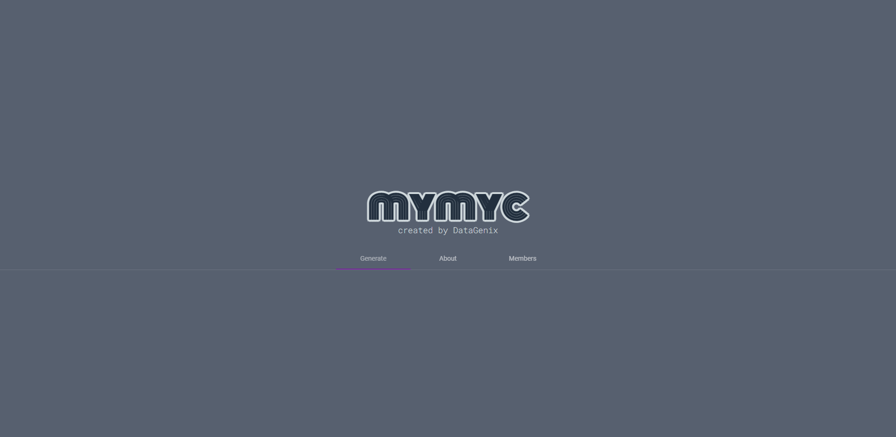
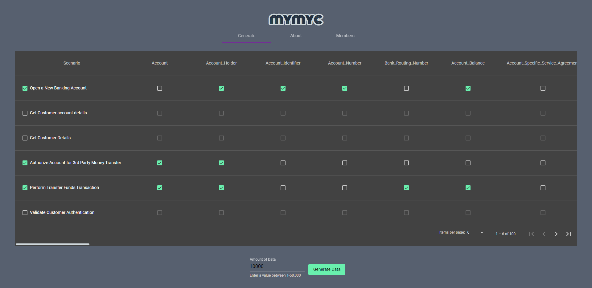

# Mymyc

 

Mymyc is a reusable test data management solution, providing a pleasing UX for those who need to generate synthetic test data for varying business scenarios. It uses an Angular frontend and a python+flask backend to handle requests and generate realistic synthetic data, in a matter of seconds!

 

